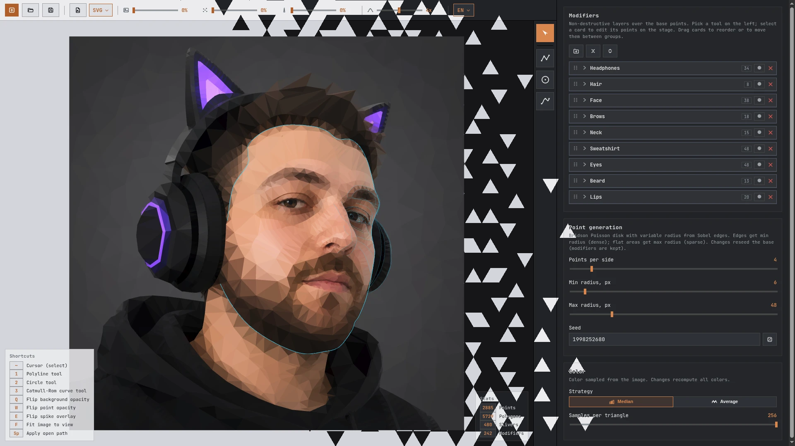

# Polygonize

A browser-based low-poly image editor. Load a photo, tune the triangulation, refine edges with shape modifiers, export as SVG or PNG.

**[EDITOR](https://jango-git.github.io/polygonize/)**



## Features

- **Smart point seeding** - Bridson Poisson disk sampling with variable radius driven by Sobel edge detection: edges get a tight minimum radius (dense triangles), flat areas get a loose maximum radius (sparse triangles). Generation is fully seeded, so a given seed reproduces the same mesh
- **Modifier stack** - Non-destructive polyline, circle, and Catmull-Rom curve layers add constraint edges on top of the base mesh; reorder or group them freely with drag-and-drop
- **Color sampling** - Average or median pixel color per triangle; optional per-vertex gradient
- **Export** - Scalable SVG or rasterized PNG up to 4096px
- **Projects** - Save and restore work as `.json`; session auto-saves to localStorage
- **Localized UI** - 21 interface languages, auto-detected from the browser and switchable in the top bar

## Keyboard shortcuts

| Key     | Action                    |
| ------- | ------------------------- |
| `~`     | Cursor (select)           |
| `1`     | Polyline tool             |
| `2`     | Circle tool               |
| `3`     | Catmull-Rom curve tool    |
| `Q`     | Flip background opacity   |
| `W`     | Flip point opacity        |
| `E`     | Flip spike overlay        |
| `F`     | Fit image to view         |
| `Space` | Apply open path           |
| `Esc`   | Cancel drawing / deselect |

## Development

```sh
npm install
npm run dev    # dev server on http://localhost:3000
npm run build  # outputs dist/bundle.js
```

## License

[MIT](LICENSE)
