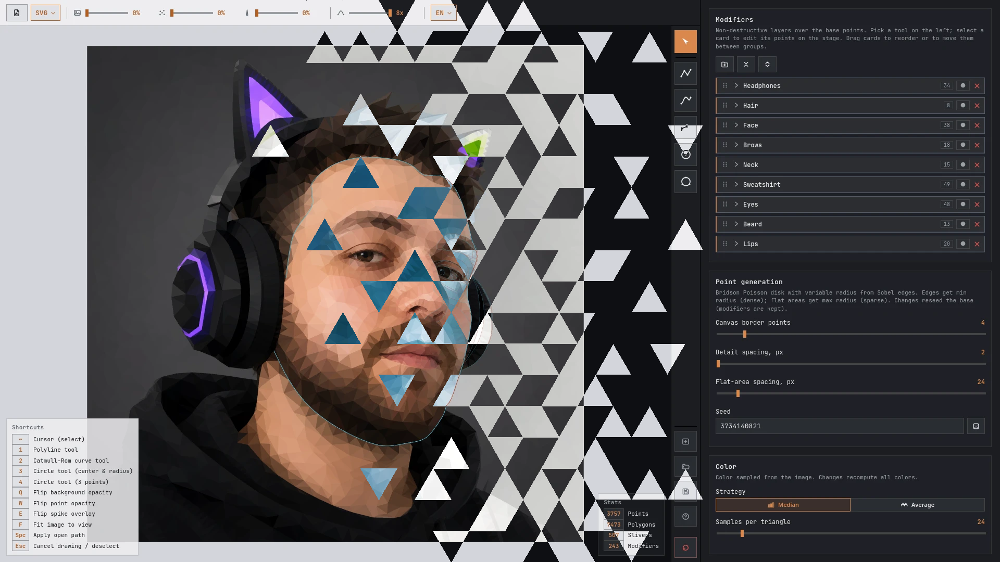

# Polygonize

[en](../README.md) · [zh-Hans](README.zh-Hans.md) · [hi](README.hi.md) · [es](README.es.md) · [fr](README.fr.md) · [bn](README.bn.md) · **pt** · [ru](README.ru.md) · [id](README.id.md) · [de](README.de.md) · [ja](README.ja.md) · [tr](README.tr.md) · [vi](README.vi.md) · [ko](README.ko.md) · [it](README.it.md) · [pl](README.pl.md) · [uk](README.uk.md) · [uz](README.uz.md) · [az](README.az.md) · [kk](README.kk.md) · [be](README.be.md)

Um editor de imagens low-poly que roda no navegador. Carregue uma foto, ajuste a triangulação, refine as bordas com modificadores de forma e exporte como SVG ou PNG.

**[EDITOR](https://jango-git.github.io/polygonize/)**



## Recursos

- **Geração inteligente de pontos** - Amostragem por disco de Poisson de Bridson com raio variável guiado pela detecção de bordas Sobel: as bordas recebem um raio mínimo apertado (triângulos densos) e as áreas planas recebem um raio máximo folgado (triângulos esparsos). A geração é totalmente determinística, então uma mesma semente reproduz a mesma malha
- **Pilha de modificadores** - Camadas não destrutivas de polilinha, círculo e curva Catmull-Rom adicionam arestas de restrição sobre a malha base; reordene-as ou agrupe-as livremente com arrastar e soltar
- **Amostragem de cor** - Cor média ou mediana dos pixels por triângulo; gradiente opcional por vértice
- **Exportação** - SVG ou PDF vetorial, ou PNG, JPG ou WebP rasterizado em até 4096px
- **Projetos** - Salve e restaure seu trabalho como `.json`; a sessão é salva automaticamente no localStorage
- **Interface localizada** - 21 idiomas de interface, detectados automaticamente pelo navegador e alternáveis na barra superior

## Atalhos de teclado

| Tecla   | Ação                                 |
| ------- | ------------------------------------ |
| `~`     | Cursor (selecionar)                  |
| `1`     | Ferramenta polilinha                 |
| `2`     | Ferramenta curva Catmull-Rom         |
| `3`     | Ferramenta círculo (centro e raio)   |
| `4`     | Ferramenta círculo (3 pontos)        |
| `Q`     | Alternar opacidade do plano de fundo |
| `W`     | Alternar opacidade dos pontos        |
| `E`     | Alternar sobreposição de picos       |
| `F`     | Ajustar imagem à visualização        |
| `Space` | Aplicar caminho aberto               |
| `Esc`   | Cancelar desenho / desmarcar         |

## Desenvolvimento

```sh
npm install
npm run dev    # servidor de desenvolvimento em http://localhost:3000
npm run build  # gera dist/bundle.js
```

## Licença

[MIT](../LICENSE)
